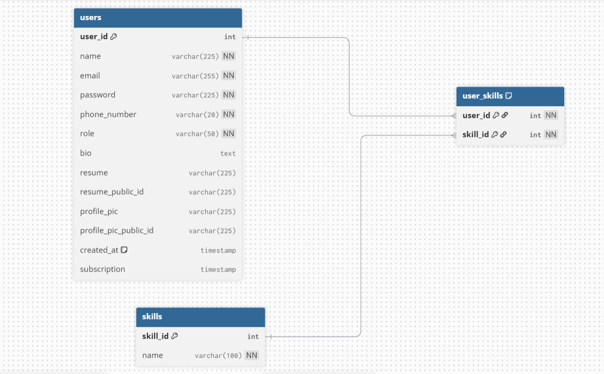

# Auth Service – Jobvyn

Authentication and Identity Service for the Jobvyn platform.

This service handles secure user onboarding, authentication, and password recovery.  
It integrates with external services for resume uploads and email notifications, following a microservice-ready and production-focused architecture.

---

## What This Service Does

- Registers **Jobseekers** and **Recruiters**
- Secure login using **JWT Authentication** (15-day expiry)
- Resume upload via dedicated Upload Service (Cloudinary-backed)
- Password reset with Redis-backed secure token validation (10-minute TTL)
- Asynchronous email triggering via Kafka (`send-mail` topic)
- Automatic and safe database initialization on startup

---

## API Endpoints

All routes are prefixed with `/api/auth`. Default port: **5000**.

| Method | Route               | Description                          |
|--------|---------------------|--------------------------------------|
| POST   | `/register`         | Register a new user                  |
| POST   | `/login`            | Login and receive a JWT              |
| POST   | `/forgotPassword`   | Request a password reset email       |
| POST   | `/reset/:token`     | Reset password using the reset token |

### POST `/register`

**Body (recruiter):**
```json
{
  "name": "Jane Doe",
  "email": "jane@example.com",
  "password": "secret",
  "phoneNumber": "1234567890",
  "role": "recruiter"
}
```

**Body (jobseeker):** Same fields plus optional `bio` and a multipart `file` field (PDF resume). The resume is uploaded to Cloudinary via the Upload Service.

**Response:** `201` with the `registeredUser` object and `token`.

---

### POST `/login`

**Body:**
```json
{
  "email": "jane@example.com",
  "password": "secret"
}
```

**Response:** `200` with full `userObject` (includes aggregated `skills` array) and `token`. Password is stripped from the response.

---

### POST `/forgotPassword`

**Body:**
```json
{ "email": "jane@example.com" }
```

Generates a 10-minute JWT reset token, stores it in Redis (`forgot:<email>`), and publishes a message to the Kafka `send-mail` topic. Always responds with the same message to prevent user enumeration.

---

### POST `/reset/:token`

**Body:**
```json
{ "password": "newSecret" }
```

Verifies the JWT, validates it against the Redis-stored token (single-use), updates the bcrypt-hashed password, and deletes the token from Redis.

---

## Core Application Flow

### 1. Registration

- Validates required fields
- Hashes password using bcrypt (10 rounds)
- If role is `jobseeker` → uploads resume via Upload Service
- Stores user in PostgreSQL
- Returns JWT token

### 2. Login

- Validates email & password
- Compares hashed password
- Fetches user's associated skills (via JOIN)
- Returns authenticated JWT token

### 3. Forgot Password

- Generates short-lived reset token (10 minutes)
- Stores token in Redis (prevents reuse)
- Publishes event to Mail Service via Kafka
- Sends reset link to frontend

### 4. Reset Password

- Verifies JWT reset token
- Validates Redis-stored token (one-time use)
- Hashes new password
- Deletes token after successful reset

---

## Database Design



```
users
  user_id               SERIAL PRIMARY KEY
  name                  VARCHAR(225)
  email                 VARCHAR(255) UNIQUE
  password              VARCHAR(225)        -- bcrypt hash
  phone_number          VARCHAR(20)  UNIQUE
  role                  ENUM ('jobseeker' | 'recruiter')
  bio                   TEXT
  resume                VARCHAR(225)        -- Cloudinary URL
  resume_public_id      VARCHAR(225)
  profile_pic           VARCHAR(225)
  profile_pic_public_id VARCHAR(225)
  created_at            TIMESTAMPTZ
  subscription          TIMESTAMPTZ

skills
  skill_id  SERIAL PRIMARY KEY
  name      VARCHAR(100) UNIQUE

user_skills             -- junction table
  user_id   FK → users
  skill_id  FK → skills
  PK (user_id, skill_id)
```

Tables and the `user_role` enum are auto-created on startup if they don't exist.

---

## Service Integrations

- **Upload Service** → Handles resume storage (Cloudinary)
- **Mail Service (Event-Driven)** → Sends password reset emails via Kafka `send-mail` topic
- **Redis** → Temporary secure token storage with TTL
- **PostgreSQL (Neon)** → Persistent user data storage

---

## Architecture Principles

- Stateless JWT-based authentication
- Secure password hashing (bcrypt)
- Redis-backed token invalidation (single-use reset tokens)
- Event-driven communication between services via Kafka
- Clean controller/route separation
- Structured error handling with `TryCatch` wrapper

---

## Tech Stack

**Backend**
- Node.js + TypeScript
- Express.js 5

**Database**
- PostgreSQL (Neon Serverless)

**Caching / Security**
- Redis
- JWT (jsonwebtoken) — 15-day auth tokens, 10-min reset tokens
- bcrypt (10 rounds)

**File Handling**
- Multer (in-memory storage)
- Axios (service-to-service communication)

**Messaging**
- KafkaJS — Kafka producer (`send-mail` topic)

---

## Environment Variables

```env
PORT=5000
DATABASE_URL=
JWT_SECRET=
REDIS_URL=
Kafka_Brokers=localhost:9092
UPLOAD_SERVICE_URL=
FRONTEND_URL=
```

---

## Running Locally

```bash
# Install dependencies
npm install

# Development (TypeScript watch + nodemon)
npm run dev

# Production build
npm run build
npm start
```

---

**Author:** Arun Kumar
