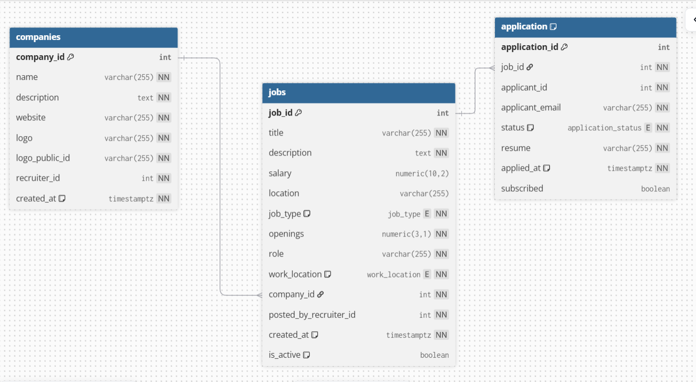

# Job Service – Jobvyn

The Job Service manages all **company, job, and application-related functionalities** in the Jobvyn platform.  
It allows recruiters to create companies, post jobs, update job details, and manage applications. Job seekers can view active jobs and apply.

---

## Core Functionality

### 1. Company Management

- Recruiters can create, update, and delete companies.
- Stores company details: name, description, website, logo.
- Ensures uniqueness and proper authorization.

### 2. Job Management

- Recruiters can post, update, and delete jobs for their companies.
- Jobs contain details like title, description, salary, location, job type, role, work location, and openings.
- Supports filtering active jobs by title or location.

### 3. Application Management

- Job seekers can apply for jobs with their resumes.
- Recruiters can view all applications for a job.
- Recruiters can update the application status (Submitted, Hired, Rejected) and notify applicants via email through Kafka integration.

---

## Service Flow

1. **Company Creation**
   - Recruiter uploads logo → Company is created in database → Logo stored in Cloudinary.

2. **Job Posting**
   - Recruiter posts a job under a company → Job stored in database → Job is available for job seekers.

3. **Applications**
   - Job seeker applies → Application stored → Recruiter can review and update status → Kafka consumer in Utils Service sends email notifications.

---

## Database Schema


## Environment Variables

```
PORT=
UPLOAD_SERVICE_URL=
KAFKA_BROKER=
```

---

## Running Locally

```bash
npm install
npm run dev
```

Server runs at:

```
http://localhost:${PORT}/api/job
```

---

## Tech Stack

- **Node.js**
- **Express.js**
- **PostgreSQL** (Database)
- **KafkaJS** (Messaging for notifications)
- **Axios** (Inter-service communication)
- **Cloudinary** (File upload for company logos)
- **CORS** and JSON middleware for API consumption

---

**Author:** Arun Kumar
