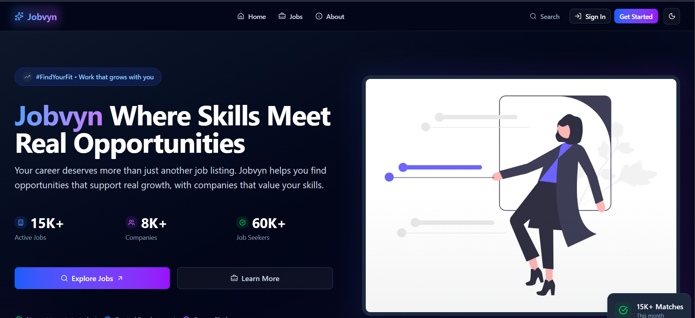

# JobVyn

A distributed recruitment platform built with a service-oriented architecture, subscription-based access control, and AI-powered utilities.

Designed to demonstrate real-world backend engineering: authentication, relational data modeling, event-driven workflows, payment verification, and containerized deployment.

---

## Overview

JobVyn is a multi-service recruitment system where Recruiters post jobs and Candidates apply through a subscription model.

The architecture separates concerns into independent services communicating via REST and Kafka, simulating production-grade backend systems rather than a monolithic demo project.

Core focus areas:

- Clean service boundaries
- Secure role-based access
- Event-driven background processing
- Structured AI integration
- Cloud-ready deployment

  

---

## Tech Stack

### Backend

- **Node.js + Express**
- **PostgreSQL**
- **Kafka**
- **JWT Authentication**
- **Razorpay (Subscription Payments)**
- **Gemini API (AI Features)**
- **Docker**
- **AWS EC2**

### Frontend

- **Next.js**
- **TypeScript**
- **Tailwind CSS**
- **shadcn/ui**

---

## Architecture

The system is divided into independent services:

- **Auth Service** — Handles authentication, JWT issuance, and role management.
- **User Service** — Manages profiles, subscriptions, and job applications.
- **Job Service** — Handles company creation and job lifecycle management.
- **Payment Service** — Verifies payments and activates time-based subscriptions.
- **Utility Service** — Processes asynchronous events and AI-powered features.
- **Kafka Broker** — Enables non-blocking background workflows (e.g., email notifications).

Each service is isolated, containerized, and environment-configured for deployment.

---

## Key Capabilities

- Role-based authentication (Recruiter / Candidate)
- Subscription-gated job applications
- Company and job management workflows
- Duplicate application prevention
- Event-driven email notifications via Kafka
- AI-powered Resume Analysis (structured output)
- AI-based Career Guidance generation
- Dockerized multi-service deployment on AWS

---

## System Flow (Simplified)

1. User authenticates and receives JWT.
2. Recruiter posts jobs under a company.
3. Candidate activates subscription via payment gateway.
4. Applications trigger Kafka events.
5. Utility service processes events asynchronously.
6. AI endpoints provide resume scoring and recommendations.

---

## Design Principles

- Clear separation of concerns
- Server-side validation of business rules
- Asynchronous processing for scalability
- Structured AI responses for predictable frontend rendering
- Production-oriented deployment strategy

---

## Project Structure

Each service follows a layered structure: routes → controllers → business logic → database access.

---

## Status

Backend services complete  
Kafka integration operational  
AI features integrated  
Dockerized and deployed on AWS EC2

---

Arun Kumar  
Backend Engineer | Distributed Systems Focus
