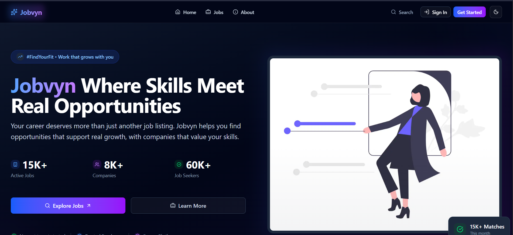
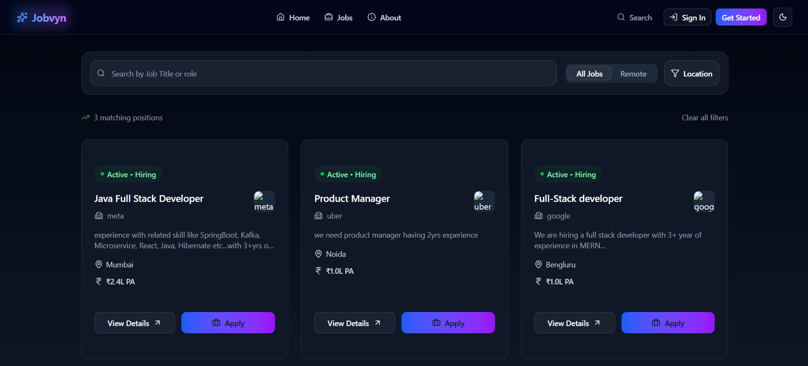

<p align="center">
  <h1 align="center">JobVyn</h1>
  <p align="center">
    The open-source distributed recruitment platform.
    <br />
    <br />
    <a href="https://github.com/Arunkoo/Jobvyn"><strong>Explore the repo »</strong></a>
    <br />
    <br />
    <a href="https://github.com/Arunkoo/Jobvyn/issues">Issues</a>
    ·
    <a href="https://github.com/Arunkoo/Jobvyn/discussions">Discussions</a>
  </p>
</p>

<p align="center">
  <a href="https://github.com/Arunkoo/Jobvyn/stargazers"></a>
  <a href="https://github.com/Arunkoo/Jobvyn/blob/main/LICENSE"></a>
  
  
</p>

---

## About

**JobVyn** is a distributed recruitment platform built with a microservices architecture. It connects **Recruiters** who post jobs with **Candidates** who apply through a subscription model — backed by event-driven workflows, real-time processing, and AI-powered utilities.

Built to simulate real-world production backend systems — not a monolith demo.



---

## Features

- **API Gateway** — Single entry point with IP rate limiting, request tracing, and reverse proxy
- **Authentication** — JWT-based auth with role management (Recruiter / Candidate)
- **Subscription Model** — Candidates activate subscriptions via Razorpay to unlock job applications
- **Job Management** — Recruiters create companies, post jobs, and manage the full job lifecycle
- **Event-Driven Workflows** — Kafka-powered async processing (e.g. email notifications on application)
- **AI Utilities** — Resume scoring, candidate–job fit analysis, and career guidance via Gemini API
- **Containerized Deployment** — Fully Dockerized, deployed on AWS EC2 with GitHub Actions CI/CD

---

## Architecture

All client requests enter through a single **API Gateway** which handles cross-cutting concerns before forwarding to downstream services.

```
Client
  │
  ▼
API Gateway
  ├── /api/auth      →  Auth Service
  ├── /api/user      →  User Service
  ├── /api/job       →  Job Service
  ├── /api/utils     →  Utils Service
  └── /api/payment   →  Payment Service
                              │
                         Kafka Broker
                              │
                         Utils Service (async consumers)
```

### Services

| Service | Responsibility |
|---|---|
| **API Gateway** | Routing, rate limiting (Redis), request tracing, error handling |
| **Auth Service** | Registration, login, JWT issuance, role-based access |
| **User Service** | Profiles, subscription management, job applications |
| **Job Service** | Company creation, job posting, application tracking |
| **Payment Service** | Razorpay webhook handling, subscription activation |
| **Utils Service** | Kafka consumers, AI resume analysis, career guidance |

---

## Tech Stack

### Backend

| | Technology |
|---|---|
| Runtime | Node.js (ESM) |
| Framework | Express 5 |
| Language | TypeScript |
| Database | PostgreSQL |
| Cache / Rate Limiting | Redis |
| Message Broker | Kafka |
| Auth | JWT |
| Payments | Razorpay |
| AI | Google Gemini API |
| Containerization | Docker |
| Cloud | AWS EC2 |
| CI/CD | GitHub Actions |

### Frontend

| | Technology |
|---|---|
| Framework | Next.js + TypeScript |
| Styling | Tailwind CSS + shadcn/ui |

---

## How It Works

```
1. Client sends a request to the API Gateway
2. Gateway assigns a unique request ID and logs the request
3. Redis rate limiter checks the IP (100 req / 60s by default)
4. Request is proxied to the correct downstream service
5. Response is returned with status, duration, and trace headers
```

**Application flow:**

```
1. User registers and receives a JWT
2. Recruiter creates a company and posts a job
3. Candidate activates a subscription via Razorpay
4. Candidate applies → Kafka event is published
5. Utils service consumes the event asynchronously
6. AI endpoints score the resume and generate career guidance
```

---

## ER Diagram



---

## Getting Started

Each service is independently runnable. Clone the repo and navigate to the service you want to run.

```bash
git clone https://github.com/Arunkoo/Jobvyn.git
cd Jobvyn/backend/<service>
npm install
npm run dev
```

Each service requires its own `.env` file. Refer to the README inside each service directory for the required environment variables.

### Run with Docker

```bash
docker-compose up --build
```

---

## Project Structure

```
Jobvyn/
├── backend/
│   ├── gateway/        # API Gateway
│   ├── auth/           # Auth Service
│   ├── user/           # User Service
│   ├── job/            # Job Service
│   ├── payment/        # Payment Service
│   └── utils/          # Utils + AI Service
├── frontend/           # Next.js App
├── docs/               # Architecture diagrams
└── docker-compose.yml
```

---

## Contributing

Pull requests are welcome. For major changes, open an issue first to discuss what you'd like to change.

---

## Author

**Arun Kumar** — Backend Engineer · Distributed Systems

<a href="https://github.com/Arunkoo">GitHub</a> · <a href="https://www.linkedin.com/in/arun-kumar-a51b13257">LinkedIn</a>
